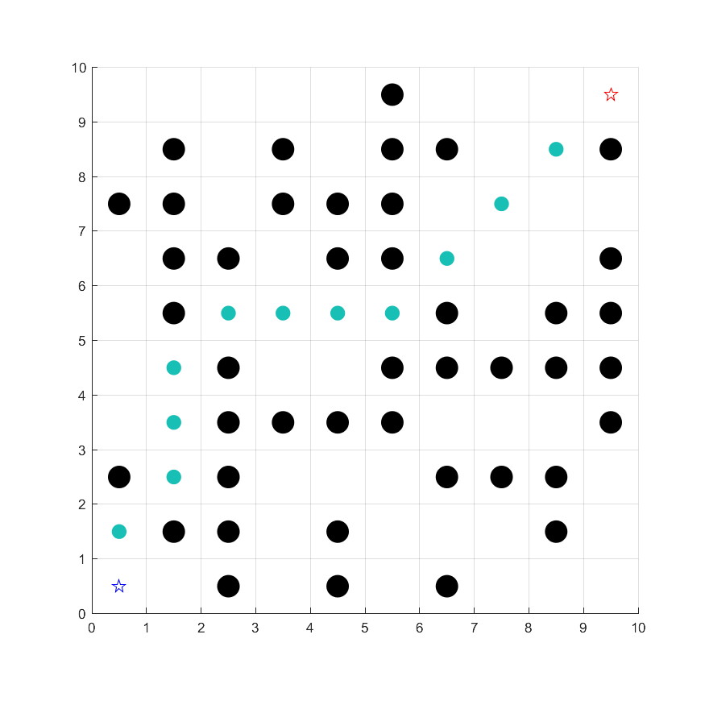

# An matlab implementation of 2D A* algorithm
 An matlab implementation of 2D A* algorithm，more details can be found in https://mesywang.github.io/2020/01/23/路径规划(一)-dijkstra和Astar/

Run the main.m：

	

